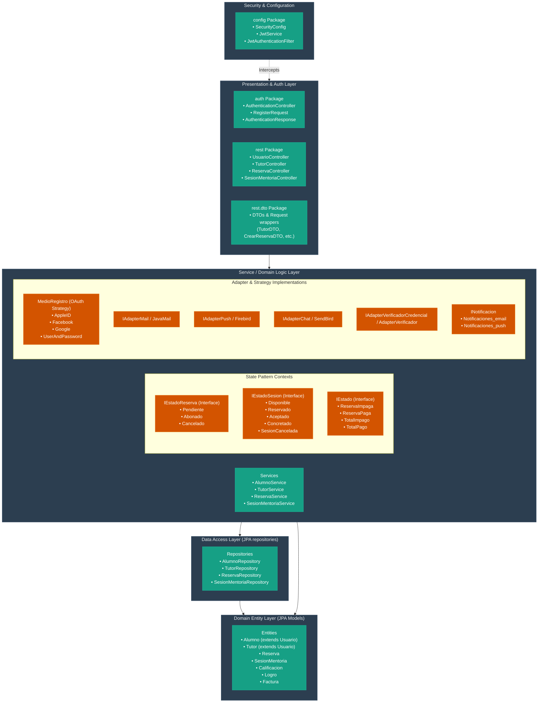

# UADE Mentor - Project Architecture & Agent Roles

Welcome to the **UADE Mentor** developer and architecture overview. This document provides a complete guide to the system's objective, the proposed specifications from the PDF, the layered architecture structure, and the software design patterns implemented in the codebase.

---

## 1. Project Objective

**UADE Mentor** is an educational platform designed to connect university students with academic tutors or mentors within the university community. 
The system allows students to find rapid, organized academic assistance for their courses, while enabling tutors to offer academic mentoring and sessions on specific subjects. 

The primary business objectives of the system are to manage:
- **Users and Roles**: Students, Tutors/Mentors, and Administrators.
- **Academic Tutoring & Material**: Subject-specific mentoring profiles, courses, and availability.
- **Booking & Reservations**: Creating, confirming, and canceling sessions.
- **Ratings & Reviews**: Quality control for the tutoring experience.
- **System Notifications**: Multi-channel delivery (Email and Push).
- **Academic History**: Session tracking for both tutors and students.
- **Gamification**: Incentivizing platform engagement through unlockable achievements.

---

## 2. PDF Proposal Specifications & Roles

The system is defined around three main user profiles, each having specific platform features:

### Student (Alumno)
*The user seeking academic support.*
- **Key Features**:
  - Register & authenticate (standard or external via OAuth).
  - Edit personal profile.
  - Search and filter tutors by Subject, Major (Carrera), Modality (Online/Presencial), Hourly Availability, Rating, and Name.
  - View tutor details (personal info, subjects taught, modality, rating average, previous reviews, total sessions conducted).
  - Request/book mentoring sessions and cancel existing bookings.
  - View academic booking history (pending, completed, canceled, rated).
  - Rate and review tutors (1 to 5 stars + comments).
  - Receive automated notifications.

### Tutor / Mentor
*The user providing tutoring services.*
- **Key Features**:
  - Register as a tutor, providing academic validation/certifications, major, subjects taught, and a personal bio.
  - Manage tutoring availability (hours, dates, modality).
  - Accept or reject student booking requests.
  - View tutoring history (past, pending, and canceled sessions).
  - Receive ratings/reviews from students (updating their public average score).
  - Unlock performance achievements (gamification).

### Administrator
*The user governing the platform.*
- **Key Features**:
  - Validate, approve, reject, or suspend tutor applications.
  - Manage user database (students, tutors).
  - Add, edit, or remove subjects (Materias).
  - Configure global platform parameters (e.g. fees, commissions).
  - Supervise system performance and audit logs.

### Core Booking Flow
```
[Student] requests booking -> [Tutor] notified -> [Tutor] accepts -> [Booking Confirmed] -> [Session Completed] -> [Student] rates Tutor
```
- **Cancellation Policy**: Free cancellation if the booking is still *Pending*. Once accepted, cancellations notify the tutor. *Finalized* sessions cannot be canceled.
- **Gamification System**:
  - **For Students**: Achievements like *Alumno Comprometido* (Highly Committed Student) and *Alumno Evaluador* (Frequent Reviewer).
  - **For Tutors**: Achievements like *Tutor Destacado* (Highlighted Tutor) and *Tutor Experto* (Expert Tutor).
  - *Trigger*: Unlocking an achievement automatically sends a notification to the user.

---

## 3. Layered Architecture Diagram

The codebase is organized following clean architecture, strict separation of concerns, and SOLID principles. The packages are organized into 5 primary layers:



---

## 4. Software Design Patterns Mapping

The codebase applies classic software design patterns to maintain strict compliance with SOLID principles (particularly Single Responsibility, Open/Closed, and Dependency Inversion).

### A. State Pattern
Used extensively to decouple complex lifecycle transitions from entity classes, avoiding messy conditional blocks (`if-else` or `switch`).
1. **Reserva Lifecycle (`IEstadoReserva`)**:
   - *Interface*: `IEstadoReserva`
   - *Implementations*: `Pendiente`, `Abonado`, `Cancelado`
   - *Responsibility*: Controls whether payments can be made, or bookings canceled.
2. **SesionMentoria Lifecycle (`IEstadoSesion`)**:
   - *Interface*: `IEstadoSesion`
   - *Implementations*: `Disponible`, `Reservado`, `Aceptado`, `Concretado`, `SesionCancelada`
   - *Responsibility*: Handles valid state changes as the session moves from discovery to booking, acceptance, conclusion, or cancellation.
3. **Factura Payment Status (`IEstado`)**:
   - *Interface*: `IEstado`
   - *Implementations*: `ReservaImpaga`, `ReservaPaga`, `TotalImpago`, `TotalPago`
   - *Responsibility*: Manages invoicing transitions (partial deposit vs full payment).

### B. Strategy / Adapter Pattern
Used to integrate third-party providers (payment processors, social networks, message delivery) without tightly coupling the core business logic.
1. **Registration & Login Strategy (`MedioRegistro`)**:
   - *Strategies*: `Google`, `Facebook`, `AppleID`, `UserAndPassword`
   - *Responsibility*: Encapsulates different credential authorization mechanisms.
2. **Notification Adapters (`IAdapterMail`, `IAdapterPush`, `IAdapterChat`)**:
   - *Abstractions & Concrete Implementations*:
     - `IAdapterMail` implemented by `JavaMail` (sends real/simulated SMTP emails).
     - `IAdapterPush` implemented by `Firebird` (Firebase cloud messaging).
     - `IAdapterChat` implemented by `SendBird` (realtime chat adapter).
   - *Observer Wrapper*: `INotificacion` (implemented by `Notificaciones_email` and `Notificaciones_push`) acts as the high-level listener triggered on system events.
3. **Identity Verification Adapter (`IAdapterVerificadorCredencial`)**:
   - *Abstraction*: `IAdapterVerificadorCredencial`
   - *Implementation*: `AdapterVerificador`
   - *Responsibility*: Validates tutor credentials and university registry validations.
4. **Payment Strategy**:
   - *Implementation*: `Stripe`
   - *Responsibility*: External payment processor strategy used during reservation deposit/fee payments inside `ReservaImpaga` / `TotalImpago`.

---

## 5. Legibility and SOLID Highlights
- **Single Responsibility (SRP)**: Controllers only delegate HTTP requests, Services execute business rules, Repositories query the database, and States control lifecycle transitions.
- **Open/Closed (OCP)**: Adding new external notification channels or registration methods requires creating a new strategy class implementing `INotificacion` or `MedioRegistro`, rather than modifying existing services.
- **Dependency Inversion (DIP)**: High-level services depend on interfaces (`IAdapterMail`, `IAdapterPush`) rather than concrete classes (`JavaMail`, `Firebird`). Spring boot injects the correct bean at runtime.
